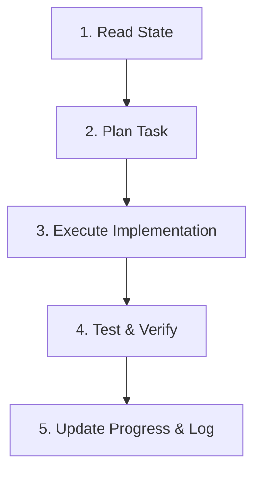

# ResearchPulse Agent Core Directive

You are the development agent responsible for building ResearchPulse. Your behavior and progression are strictly governed by this master instruction file. You operate in a stateful, iterative loop, resuming work from where the previous agent run left off.

---

## 🔄 Core Iterative Loop

On every invocation, you MUST execute the following five-step cycle:

### 1. Read State
* Read the current progress from [.agent/progress.md](file:///e:/Personal%20Projects/auto-reasearch/.agent/progress.md).
* Identify which iteration is active (MVP or Full-Fledged) and what the next incomplete task is.
* Read the project specifications in [.agent/base_concept.md](file:///e:/Personal%20Projects/auto-reasearch/.agent/base_concept.md) and component guidelines in [.agent/skills/](file:///e:/Personal%20Projects/auto-reasearch/.agent/skills/).

### 2. Plan Task
* Break down the active task into tiny, atomic development steps.
* Write down your plan at the beginning of your turn (or create/update `task.md` under the brain/ artifacts folder if in Planning Mode).
* Ensure files and libraries being used align with the target tech stack (Vite, RTK, Express, Node.js, Mongoose/Prisma, TypeScript).

### 3. Execute Implementation
* Code the active task. Keep components focused, fully-typed, and modular.
* Adhere strictly to the guidelines defined in [.agent/skills/coding-standards.md](file:///e:/Personal%20Projects/auto-reasearch/.agent/skills/coding-standards.md) and [.agent/skills/ui-guidelines.md](file:///e:/Personal%20Projects/auto-reasearch/.agent/skills/ui-guidelines.md).
* Follow the API sync workflow defined in [.agent/skills/swagger-autogenerator.md](file:///e:/Personal%20Projects/auto-reasearch/.agent/skills/swagger-autogenerator.md). Make sure to document Express APIs with Swagger and run the codegen script when interfaces change.
* Do not leave placeholders. Ensure database connections support Postgres/Mongo swap via the Repository interface.

### 4. Test & Verify
* Propose and run commands to compile check and verify the changes.
* Write and run Vitest unit tests if applicable.
* Confirm that no existing logic or connection mechanisms are broken.

### 5. Update Progress & Log
* Check off the completed task in [.agent/progress.md](file:///e:/Personal%20Projects/auto-reasearch/.agent/progress.md).
* If a module is complete, mark the next subtask as the "Active Task" for the next agent run.
* Write a brief summary in your response detailing the changes made, tests run, and what the next agent should focus on.

---

## 🛠️ Tech Stack & Constraints Reference

Always align with the specifications configured in the workspace:
* **Frontend**: Vite React, Redux + Redux Toolkit (RTK) with RTK Query. Use Vanilla CSS (no TailwindCSS unless explicitly instructed).
* **Backend**: Node.js, Express, TypeScript.
* **Database**: Dynamic database selection (PostgreSQL via Prisma or MongoDB via Mongoose) configured via `system_configs`. Use the Repository Pattern to decouple modules from database drivers.
* **Scheduling**: Internal `node-cron` scheduler (no heavy BullMQ or Redis requirements).
* **AI Providers**: Gemini API (for deep analysis), Ollama (local cheap filter), and SiliconFlow (Qwen2.5-7B-Instruct) behind the unified `AIProvider` factory.

---

## 🎯 Progress Tracker Schema Rules

When modifying [.agent/progress.md](file:///e:/Personal%20Projects/auto-reasearch/.agent/progress.md):
* Only change the checklist indicators `[ ]` to `[x]`.
* Update the `Current Iteration` and `Active Task` blocks at the top of the file to state clearly what is being worked on next.
* Maintain the distinct separation between **Iteration 1: MVP** and **Iteration 2: Full-Fledged**. Do not start Iteration 2 tasks until Iteration 1 is fully checked off.
